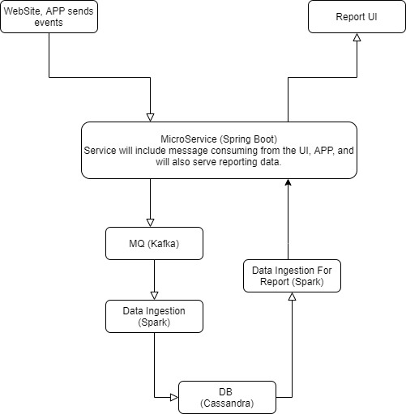

# PaytmLabs SDE Challenge

## Coding Question

Write an interface for a data structure that can provide the moving average of the last N elements added, add elements to the structure and get access to the elements. Provide an efficient implementation of the interface for the data structure.

### Minimum Requirements

1. Provide a separate interface (IE `interface`/`trait`) with documentation for the data structure
2. Provide an implementation for the interface
3. Provide any additional explanation about the interface and implementation in a README file.

## Design Question

Design A Google Analytic like Backend System.
We need to provide Google Analytic like services to our customers. Please provide a high level solution design for the backend system. Feel free to choose any open source tools as you want.

### Requirements

1. Handle large write volume: Billions of write events per day.
2. Handle large read/query volume: Millions of merchants wish to gain insight into their business. Read/Query patterns are time-series related metrics.
3. Provide metrics to customers with at most one hour delay.
4. Run with minimum downtime.
5. Have the ability to reprocess historical data in case of bugs in the processing logic.

### Solution to the GA design
Basically we need to use MQ, data ingest system, elastic DB for performance, and data insight utils.

Starting with the flow in the diagram.
1. Website, App will send analytics related data to our Microservice. These are purely user end.
2. Microservice will push the data to MQ. All the calls will be async, none blocking. We can use a CQRS pattern to save all the data which will be helpful if there is a bug, or recreate certain scenario. Microservice can be written with **Spring Boot, or Nodejs + Express**
3. MQ will send message to Data Ingestion service. For MQ, we can use **Kafka**. If for the worst case, there is a downtime in ingestion service, we need to write our own application to consume message and send back to ingestion service, or replay the events.
4. We will be using **Spark** to process/massage the data and send to DB.
5. DB will be **Cassandra**, which is designed to be scalable. 
6. Another **Spark** will be in place to populate the data needed for the reporting system
7. Micro service layer will again expose a few *admin* endpoints for the report UI to read data. For micro service hosting, we can have them hosted on k8s. Based on the traffic of read and write, we can set certain number of nodes for consuming the analytics data, and certain for reporting. 
An API gateway can be in place to redirect the traffic to the proper node. If performance boost is needed for Report UI, we can add a cache layer like Redis.
8. Report UI, we can use **Tableu**, or other data reporting libraries or software. Doesn't matter too much. Either Micro Service, or Report UI needs to provide authentication service to authorize access to the *admin* endpoints.

